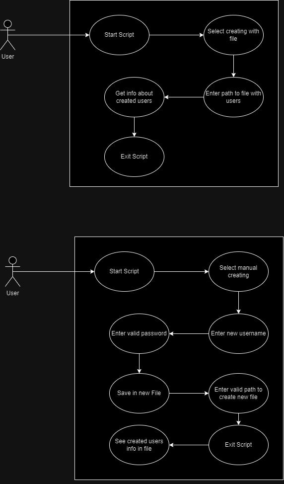

## Collaborative User Management System: Award-Winning Project

This repository contains a high-quality user management system developed by a team of dedicated students, which achieved the best grade in our school class. The project includes a suite of tools and comprehensive documentation, crafted through collaboration across multiple platforms:

- **Leonid**: Designed a Bash script for effective user management on Unix/Linux systems, enabling streamlined administrative operations.

- **Marjan**: Developed a robust C# application along with a PowerShell script, enhancing user management capabilities on Windows. The application provides a user-friendly graphical interface, while the PowerShell script offers advanced administrative functionality.

- **Contributions:** Other team members focused on creating extensive and thorough documentation that contributed to the project’s understanding and success. Their efforts in detailing setup, usage, and maintenance instructions were key to our top performance.

### Key Features ###

- **Bash Script:** Streamlines user management tasks on Unix/Linux platforms.
- **PowerShell Script:** Empowers advanced user management on Windows with powerful scripting capabilities.
- **C# Application:** Combines depth and usability, offering a comprehensive interface for managing users effectively on Windows.

### Flow Diagramm PowerShell ###

### Flow Diagramm Bash ###

## Program Application ##

### Use Case

### Test Case

### Demo Videos ###

Here is the video from the PowerShell script and the C# App that I created
- [Click here to view the video](01_Leonid/LB1_UserManager_Bash.mp4)

Here is the video from the Bash script that Leonid created
- [Click here to view the video](02_Marjan/LB1_UserManager_PowerShell.mp4)
